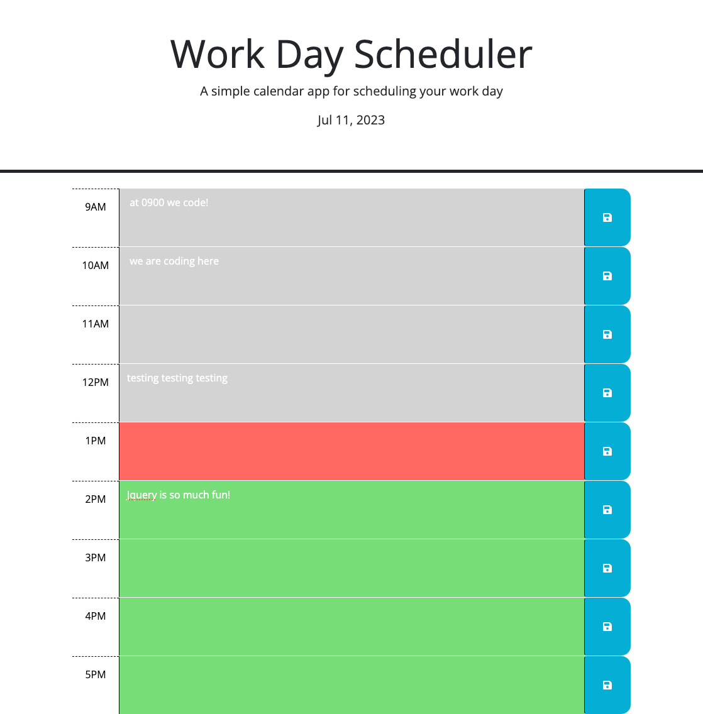

# day-planner

## Description

This webpage application is a color-coded **day planner** which runs from 9:00 am - 5:00 pm, wherein most people find themselves at work and in need of some order in their lives. This **day planner** is a vital part of developing great habits, of which many people are in need!

## Installation

N/A

## Usage

This color-coded **day planner** web application uses JavaScript code to turn the current hour on the planner red, the future hour to green, and all previous hours are set to grey. The goal was to save the user inputs into local storage in case the user accidentally closed the tab and lost their progress. The local storage saves these user inputs to solve that problem. At the top of the web application, there is also a standard date on display for the current day. 

## Screenshot

## Links

https://zbichsel.github.io/day-planner

https://www.github.com/zbichsel/day-planner

## Credits

N/A

## Contact Me

If you have any questions, please contact me at: biksel09@gmail.com

## License

Please refer to the LICENSE in the repository.